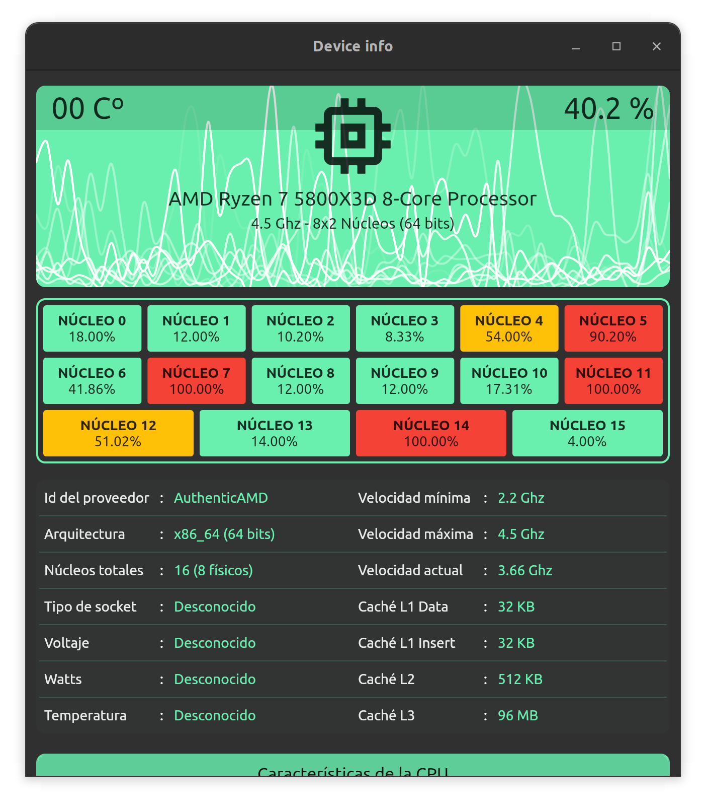

# CPU info

A simple graphical interface to observe the current state of CPU usage on Linux using Flutter.



## Supported languages:

- English
- Spanish
- Esperanto

## Requirements

- Flutter SDK >=2.18.0 <3.0.0
- GNU/Linux
- Packages: `cmake`, `ninja-build`, `clang` and `libgtk-3-dev`.

On Ubuntu 22.04 LTS run:

```
apt -y install cmake ninja-build clang libgtk-3-dev;
snap install flutter --classic;
```

## How to run

In the `app` directory run:

```
flutter run
```

## How to build

In the `app` directory run:

```
flutter build linux --release
```

Build file in: `build/linux/x64/release/bundle/device_info`.

## Support

This software is free and its source code is totally free for you to use and learn. Support the creator.

[](https://www.paypal.com/donate/?hosted_button_id=KM2KBE8F982KS)
